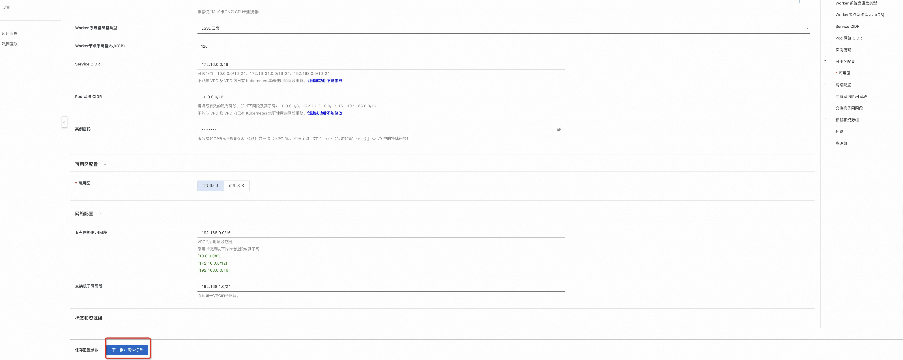
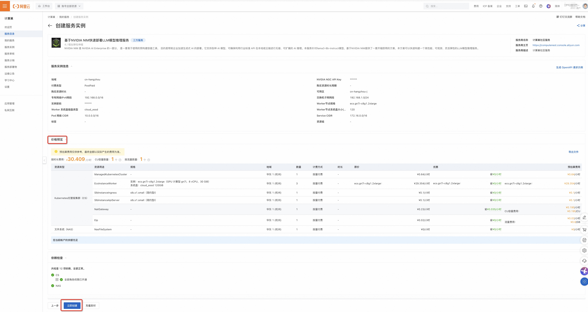
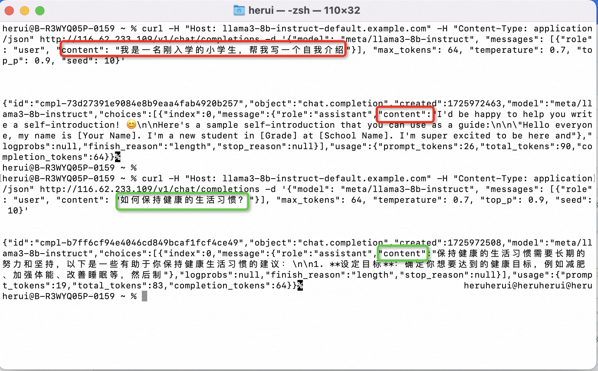

# 基于NVIDIA NIM快速部署LLM模型推理服务的部署说明

>**免责声明：**本服务由第三方提供，我们尽力确保其安全性、准确性和可靠性，但无法保证其完全免于故障、中断、错误或攻击。因此，本公司在此声明：对于本服务的内容、准确性、完整性、可靠性、适用性以及及时性不作任何陈述、保证或承诺，不对您使用本服务所产生的任何直接或间接的损失或损害承担任何责任；对于您通过本服务访问的第三方网站、应用程序、产品和服务，不对其内容、准确性、完整性、可靠性、适用性以及及时性承担任何责任，您应自行承担使用后果产生的风险和责任；对于因您使用本服务而产生的任何损失、损害，包括但不限于直接损失、间接损失、利润损失、商誉损失、数据损失或其他经济损失，不承担任何责任，即使本公司事先已被告知可能存在此类损失或损害的可能性；我们保留不时修改本声明的权利，因此请您在使用本服务前定期检查本声明。如果您对本声明或本服务存在任何问题或疑问，请联系我们。

## 概述

  NVIDIA NIM 是 NVIDIA AI Enterprise 的一部分， 是一套易于使用的预构建容器工具， 目的是帮助企业加速生成式 AI 的部署。它支持各种 AI 模型，可确保利用行业标准 API 在本地或云端进行无缝、可扩展的 AI 推理。本服务针对llama3-8b-instruct模型，基于NVIDIA NIM提供了一套开箱即用的方案，本方案可以快速构建一个高性能、可观测、灵活弹性的LLM模型推理服务

## 前提准备

使用NVIDIA NIM需要一个API Key， API Key是一个身份验证令牌, 从NVIDIA的NGC仓库下载模型和容器需要使用API Key进行身份验证。
参考 NVIDIA NIM 文档，生成 NVIDIA NGC API key，访问需要部署的模型镜像，比如本文中使用的 Llama3-8b-instruct：
https://docs.nvidia.com/nim/large-language-models/latest/getting-started.html#generate-an-api-key

## RAM账号所需权限

部署服务实例，需要对部分阿里云资源进行访问和创建操作。因此您的账号需要包含如下资源的权限。 说明：当您的账号是RAM账号时，才需要添加此权限

| 权限策略名称 | 备注 |
| --- | --- |
| AliyunECSFullAccess | 管理云服务器服务（ECS）的权限 |
| AliyunBSSReadOnlyAccess | 只读访问费用中心（BSS）的权限 |
| AliyunCSFullAccess | 管理容器服务（CS）的权限 |
| AliyunVPCFullAccess | 管理专有网络（VPC）的权限 |
| AliyunROSFullAccess | 管理资源编排服务（ROS）的权限 |
| AliyunSLBFullAccess | 管理负载均衡服务（SLB）的权限 |
| AliyunComputeNestUserFullAccess | 管理计算巢服务（ComputeNest）的用户侧权限 |

## 部署流程
### 部署步骤

1. 单击[部署链接](https://computenest.console.aliyun.com/service/instance/create/cn-hangzhou?type=user&ServiceId=service-8cd0757070b848a399e4)，
进入服务实例部署界面，根据界面提示，填写参数完成部署。
   
   
2. 参数填写完成后可以看到对应询价明细，确认参数后点击**下一步：确认订单**。
   
3. 确认订单完成后同意服务协议并点击**立即创建**
   进入部署阶段。
4. 等待部署完成后就可以开始使用服务，进入服务实例详情查看使用说明。通过cURL发送HTTP请求访问推理服务，修改content的内容，即可自定义和推理服务交互的内容。
   

## 使用流程

根据服务实例详情页中使用说明的藐视，发送请求到推理服务，例如在终端中使用cURL发送HTTP请求，修改content的内容，即可自定义和推理服务交互的内容。
如下图所示为与推理服务两次进行交互的请求和响应。

